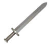
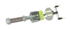
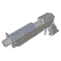
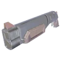
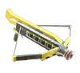

##### Melee weapons can be pulled away and towards from the player based on the grabbers range

|       Name        |           Apperance            |   Cost    |                  Damage                   |                                                                                   Description                                                                                   |
| :---------------: | :----------------------------: | :-------: | :---------------------------------------: | :-----------------------------------------------------------------------------------------------------------------------------------------------------------------------------: |
|   Baseball Bat    |     | $38K-$48K |                    20                     |            Has 10 hits before needing an recharge, fligns enemies far away on impact dealing extra physics damage when in contact with surfaces, stuns every monster            |
|    Frying Pan     |         | $14K-$18K |                    18                     |                                                    Has 15 hits before needing an recharge, stuns only a part of the monsters                                                    |
|   Sledge Hammer   |      | $38K-$48K |                    150                    |                                                           Has 10 hits before needing an recharge, stuns most monsters                                                           |
|       Sword       |              | $18K-$20K |                    50                     |                                                    Has 15 hits before needing an recharge, stuns only a select few monsters                                                     |
| Inflatable Hammer |  | $8K-$12K  | 5 Normally and 250 if an explosion occurs | Has 20 hits before needing an recharge, has an about 5% chance to cause an explosion on impact dealing 250 damage stuning the enemy it hits (normaly doesn't stun any monsters) |
|      Prodzap      |         | $22K-$30K |                     8                     |                                                           Has 16 hits before needing an recharge, stuns every monster                                                           |
##### Ranged weapons allow the player to deal with monsters from a distance (not every weapon is fully accurate), unlike the melee weapons, the player cannot pull the weapon away or closer

|      Name       |          Apperance          |   Cost    |         Damage         |                                                                                       Descripton                                                                                       |
| :-------------: | :-------------------------: | :-------: | :--------------------: | :------------------------------------------------------------------------------------------------------------------------------------------------------------------------------------: |
|       Gun       |             | $18K-$20K |           80           |                                               Has 15 shots before needing an recharge, slightly inaccurate (aim up for consistent shots)                                               |
|     Shotgun     |        | $38K-$48K |       300 (6x30)       |                                          Has 5 shots before needing an recharge, often wobbly - sometimes causing some pellets to not connect                                          |
|    Tranq Gun    |       | $14K-$18K |           0            |                                        Has 8 shots before needing an recharge, hard to aim at a distance but stuns every monster for 18 seconds                                        |
|  Pulse Pistol   |   | $14K-$18K |           25           | Has 12 shots before needing an recharge, really hard to aim at a distance but throws enemies away dealing extra physics damage on impact with surfaces while also stunning every enemy |
| Photon Blaster  |  | $38K-$48K | 45 per hit (270 total) |                                              Has 5 shots before needing an recharge, fires a beam that has great and consistent accuracy                                               |
|     Boltzap     |         | $14K-$18K |           8            |                               Has 20 shots before needing an recharge, stuns every monster but only for a short time (1.5 seconds), has decent accuracy                                |
| C.A.R.T. Cannon |      | $38K-$48K |          500           |                    Has 5 shots before needing an recharge, fires a fireball that explodes on impact, hard to aim at smaller enemies because the weapon lacks pitch                     |
| C.A.R.T. Laser  |       | $38K-$48K |          800           |                      Has 5 shots before needing an recharge, fires a beam like the Photon blaster, hard to aim at smaller enemies because the weapon lacks pitch                       |
